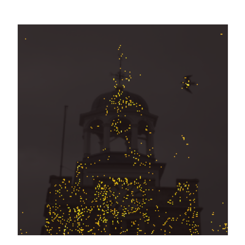

# Weighted Integrated Gradients

An implementation of Weighted Integrated Gradients for Explainable AI.

## Overview

This project implements a novel approach to explainable AI by weighting multiple baselines in Expected Gradients based on their contribution to the explanation. The implementation uses deletion metrics to automatically compute optimal baseline weights.

## Features

- **Multiple Baseline Attribution**: Supports multiple baselines for computing attributions
- **Automatic Baseline Weighting**: Uses deletion metrics to automatically weight baselines based on their quality
- **Evaluation Metrics**: Includes deletion curve and AUC metrics for attribution quality assessment
- **Clean Architecture**: Well-organized, modular codebase with clear separation of concerns

## Project Structure

```
weighted-integrated-gradients/
├── src/                     # Source code package
│   ├── __init__.py
│   ├── config.py            # Configuration constants
│   ├── explainers/          # Attribution methods (IG, WG)
│   │   ├── __init__.py
│   │   ├── ig_explainer.py
│   │   └── wg_explainer.py
│   ├── utils/               # Utility functions
│   │   ├── __init__.py
│   │   ├── image_utils.py   # Image processing
│   │   ├── model_loader.py  # Model loading
│   │   ├── model_utils.py   # Model inference
│   │   └── visualization.py # Visualization tools
│   └── metrics/             # Evaluation metrics
│       ├── __init__.py
│       ├── attribution_utils.py
│       └── deletion_metrics.py
├── data/                    # Dataset directory
│   ├── Image/               # Input images
│   └── Mask/                # Ground truth masks
├── sample/                  # Sample images
│   └── church.png
├── output/                  # Output directory
├── main.py                  # Main script for single image
├── eval.py                  # Evaluation script for datasets
├── requirements.txt
└── README.md
```

## Installation

1. Navigate to the project directory:
```bash
git clone https://github.com/KienTranDSAI/Weighted-Integrated-Gradients.git
cd Weighted-Integrated-Gradients
```

2. Install dependencies:
```bash
pip install -r requirements.txt
```

## Quick Start

### Try Online with Kaggle

You can run the evaluation directly on Kaggle without any local setup:

🚀 **[Run Evaluation on Kaggle](http://kaggle.com/code/tranductuankien/eval-wg/edit)**

The Kaggle notebook includes:
- Pre-configured environment with all dependencies
- Sample dataset ready to use
- Interactive evaluation with all models
- Visualization of results

## Usage

### Single Image Explanation

Generate a saliency map for a single image:

```bash
python main.py --input path/to/your/image.png --output path/to/output/directory
```

#### Options:
- `--input`: Path to input image  
- `--output`: Output directory for saving results   
- `--model`: Model to use - choices: `densenet121`, `mobilenet_v2`, `resnet50`, `resnet101`, `vgg16`, `vgg19` 
- `--num-points`: Number of top attribution points to display   
- `--img-alpha`: Alpha transparency for original image 
- `--sali-alpha`: Alpha transparency for saliency map 

#### Examples:
```bash
# Using default VGG16 model
python main.py --input sample/church.png --output output

# Using ResNet50 model
python main.py --input sample/church.png --output output --model resnet50

# Using DenseNet121 with custom visualization parameters
python main.py --input sample/church.png --output output --model densenet121 --num-points 500 --img-alpha 0.6
```

### Dataset Evaluation

Evaluate on a dataset with masks:

```bash
python eval.py --dataset-dir path/to/dataset
```

#### Options:
- `--model`: Model to use - choices: `densenet121`, `mobilenet_v2`, `resnet50`, `resnet101`, `vgg16`, `vgg19`
- `--dataset-dir`: Path to dataset directory containing `Image/` and `Mask/` folders
- `--num-images`: Number of images to evaluate

#### Examples:
```bash
# Evaluate using VGG16 on local dataset
python eval.py --dataset-dir ./data --model vgg16

# Evaluate using ResNet101 on 20 images
python eval.py --dataset-dir ./data --model resnet101 --num-images 20

# Evaluate all models automatically using script
./scripts/evaluate_all_models.sh ./data 20
```

This will:
1. Compute attributions for all images using multiple baselines
2. Calculate baseline weights using deletion metrics
3. Compare three methods:
   - Expected Gradients (EG)
   - Weighted baseline attribution (WG)
   - Filtered weighted baseline attribution (FWG)
4. Print AUC deletion scores for each method

## Method

### Weighted Integrated Gradients

The method works as follows:

1. **Multiple Baselines**: Generate multiple baseline images (white, black, random, median, etc.)
2. **Compute Attributions**: Use Integrated Gradients to compute attributions for each baseline
3. **Quality Assessment**: For each baseline, compute its fitness
4. **Weight Calculation**: Baselines requiring fewer deletions are given higher weights (inverse relationship)
5. **Weighted Attribution**: Combine individual baseline attributions using the computed weights

### Evaluation Metrics

- **Deletion Curve**: Measures how quickly model confidence drops as important pixels are removed
- **Area Under Curve (AUC)**: Lower AUC indicates better attributions (confidence drops faster)

## Supported Models

The following pre-trained models are supported:

| Model | Architecture | Parameters |
|-------|-------------|------------|
| `densenet121` | DenseNet-121 | 8M |
| `mobilenet_v2` | MobileNetV2 | 3.5M |
| `resnet50` | ResNet-50 | 25.6M |
| `resnet101` | ResNet-101 | 44.5M |
| `vgg16` | VGG-16 | 138M |
| `vgg19` | VGG-19 | 144M |

All models use ImageNet pre-trained weights.

## Configuration

Key parameters can be modified in `src/config.py`:

- `DEFAULT_RANDOM_SEED`: Random seed for reproducibility (default: 8)
- `DEFAULT_NUM_SAMPLES`: Number of integration samples (default: 6)
- `DEFAULT_THRESHOLD`: Threshold for filtering weak baselines (default: 0.25)
- `DEFAULT_TARGET_RATIO`: Target confidence ratio for deletion (default: 0.5)
- `DEFAULT_IMAGE_SIZE`: Input image size (default: (224, 224))

## Example Results



The visualization shows:
- Original image (transparent)
- Top-K most important pixels highlighted in red

## Requirements

- Python 3.7+
- PyTorch 1.8+
- torchvision 0.9+
- NumPy 1.19+
- Matplotlib 3.3+
- SHAP 0.39+
- Pillow 8.0+

## Authors

- Tran Duc Tuan Kien
- Nguyen Trong Tam
- Nguyen Hoang Son
- Nguyen Duc Anh

## License

MIT License

## Contributing

Contributions are welcome! Please feel free to submit a Pull Request.

## Contact

For questions or issues, please open an issue on GitHub.
