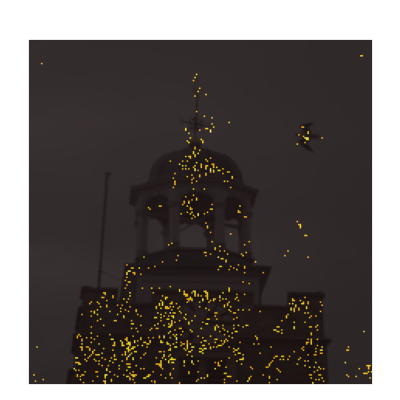

# Weighted Integrated Gradients

An implementation of Weighted Integrated Gradients for Explainable AI, designed for research paper demonstrations.

## Overview

This project implements a novel approach to explainable AI by weighting multiple baselines in Integrated Gradients based on their contribution to the explanation. The implementation uses deletion metrics to automatically compute optimal baseline weights.

## Features

- **Multiple Baseline Attribution**: Supports multiple baselines (white, black, random, median) for computing attributions
- **Automatic Baseline Weighting**: Uses deletion metrics to automatically weight baselines based on their quality
- **Evaluation Metrics**: Includes deletion curve and AUC metrics for attribution quality assessment
- **Clean Architecture**: Well-organized, modular codebase with clear separation of concerns

## Project Structure

```
weighted-integrated-gradients/
├── src/
│   ├── explainers/          # Attribution methods (IG, WIG)
│   │   ├── ig_explainer.py
│   │   └── wg_explainer.py
│   ├── utils/               # Utility functions
│   │   ├── image_utils.py   # Image processing
│   │   ├── model_utils.py   # Model inference
│   │   └── visualization.py # Visualization tools
│   ├── metrics/             # Evaluation metrics
│   │   ├── deletion_metrics.py
│   │   └── attribution_utils.py
│   └── config.py            # Configuration constants
├── data/                    # Dataset directory
│   ├── Image/
│   └── Mask/
├── sample/                  # Sample images
├── output/                  # Output directory
├── main.py                  # Main script for single image
├── eval.py                  # Evaluation script for datasets
├── requirements.txt
└── README.md
```

## Installation

1. Clone the repository:
```bash
git clone https://github.com/YourUsername/Weighted-Integrated-Gradients.git
cd Weighted-Integrated-Gradients
```

2. Install dependencies:
```bash
pip install -r requirements.txt
```

## Usage

### Single Image Explanation

Generate a saliency map for a single image:

```bash
python main.py --input path/to/your/image.png --output path/to/output/directory
```

#### Options:
- `--input`: Path to input image (required)
- `--output`: Output directory for saving results (required)
- `--num-points`: Number of top attribution points to display (default: 1000)
- `--img-alpha`: Alpha transparency for original image (default: 0.75)
- `--sali-alpha`: Alpha transparency for saliency map (default: 0.8)

#### Example:
```bash
python main.py --input sample/church.png --output output --num-points 1000 --img-alpha 0.75 --sali-alpha 0.8
```

### Dataset Evaluation

Evaluate on a dataset with masks:

```bash
python eval.py
```

This will:
1. Compute attributions for all images using multiple baselines
2. Calculate baseline weights using deletion metrics
3. Compare three methods:
   - Standard Integrated Gradients
   - Weighted baseline attribution
   - Filtered weighted baseline attribution
4. Print AUC deletion scores for each method

## Method

### Weighted Integrated Gradients

The method works as follows:

1. **Multiple Baselines**: Generate multiple baseline images (white, black, random, median, etc.)
2. **Compute Attributions**: Use Integrated Gradients to compute attributions for each baseline
3. **Quality Assessment**: For each baseline, compute how many pixels need to be deleted to drop the model confidence by 50%
4. **Weight Calculation**: Baselines requiring fewer deletions are given higher weights (inverse relationship)
5. **Weighted Attribution**: Combine individual baseline attributions using the computed weights

### Evaluation Metrics

- **Deletion Curve**: Measures how quickly model confidence drops as important pixels are removed
- **Area Under Curve (AUC)**: Lower AUC indicates better attributions (confidence drops faster)

## Configuration

Key parameters can be modified in `src/config.py`:

- `DEFAULT_RANDOM_SEED`: Random seed for reproducibility (default: 8)
- `DEFAULT_NUM_SAMPLES`: Number of integration samples (default: 6)
- `DEFAULT_THRESHOLD`: Threshold for filtering weak baselines (default: 0.25)
- `DEFAULT_TARGET_RATIO`: Target confidence ratio for deletion (default: 0.5)

## Example Results



The visualization shows:
- Original image (transparent)
- Top-K most important pixels highlighted in red

## Requirements

- Python 3.7+
- PyTorch 1.8+
- torchvision 0.9+
- NumPy 1.19+
- Matplotlib 3.3+
- SHAP 0.39+
- Pillow 8.0+

## Citation

If you use this code in your research, please cite:

```bibtex
@article{your-paper,
  title={Weighted Integrated Gradients for Explainable AI},
  author={Your Name},
  journal={Your Journal},
  year={2024}
}
```

## License

MIT License

## Contributing

Contributions are welcome! Please feel free to submit a Pull Request.

## Contact

For questions or issues, please open an issue on GitHub or contact [your-email@example.com].
